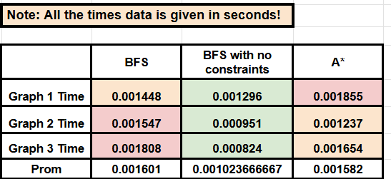

# Escape Room Solver Report

## 📌 Introduction

This project solves an escape room-like maze using both logical and heuristic search algorithms. Implementations in **Prolog** and **Python** allow comparison between exhaustive (BFS) and heuristic-driven (A*) search strategies. The environment includes doors, keys, traps, coordinates, and constraints that increase the agent's challenge in navigating from a start to a goal node.

### Objectives
- Implement BFS and A* algorithms to solve the escape room.
- Compare their performance in terms of success rate and efficiency.
- Develop a dynamic system for managing game constraints and configurations.
- Integrate Prolog and Python to leverage the strengths of both languages.

---


### Controls

M - Open the map

H - Open the solver


## ⚙️ Methodology

We followed an iterative methodology:

1. The maze was represented as a graph with logical and physical constraints.
2. A **BFS** solution was implemented in Prolog for completeness.
3. A **heuristic A\*** algorithm was implemented in Prolog.
4. We created a **Prolog-Python bridge** using `pyswip`, allowing Python to call Prolog predicates directly.
5. The system supports dynamic map by user input.

---

## 🧩 Implementation

### 📁 Project Structure


### Game State Management

The state module handles all dynamic game state information:

```prolog
% State representation with dynamic predicates
:- dynamic player_location/1.
:- dynamic inventory/1.
:- dynamic door_state/3.
:- dynamic has_piece/2.
:- dynamic object_moved/1.
:- dynamic puzzle_solved/1.
:- dynamic key_dropped/2.
:- dynamic piece_dropped/3.

% Move player with constraint checks
move_player(NewRoom) :-
    constraints:check_move_limit,
    player_location(Current),
    (door_state(Current, NewRoom, unlocked) ; door_state(NewRoom, Current, unlocked)),
    constraints:increment_move_count,
    constraints:increment_room_turn(NewRoom),
    retract(player_location(Current)),
    assertz(player_location(NewRoom)),
    (facts:final_room(NewRoom) ->
        writeln("*   CONGRATULATIONS! YOU HAVE ESCAPED!     *")
    ;
        true
    ).
```
### Dynamic Constraints System

The constraints module implements flexible game rules:

```prolog
% Dynamic constraint predicates
:- dynamic max_moves/1.
:- dynamic max_b_visits/1.
:- dynamic can_carry/2.
:- dynamic trap/2.

% Set constraints dynamically
set_max_moves(Limit) :-
    retractall(max_moves(_)),
    assertz(max_moves(Limit)).

% Check inventory limits
check_inventory_limit(Type) :-
    can_carry(Type, Limit),
    count_items_of_type(Type, Count),
    Count < Limit.

% Initialize room turn counters
initialize_constraints :-
    retractall(move_count(_)),
    assertz(move_count(0)),
    retractall(turns_in_room(_, _)),
    findall(Room, facts:room(Room), Rooms),
    forall(member(R, Rooms), assertz(turns_in_room(R, 0))).
```

### Game Configuration

The facts module supports both predefined and custom game setups:

```prolog
% Dynamic game configuration
create_custom_game :-
    clear_game_data,
    custom_game_rooms,    % Set up rooms
    custom_game_doors,    % Set up connections
    custom_game_keys,     % Place keys
    custom_game_objects,  % Add interactive objects
    custom_game_puzzles.  % Define puzzles

% Example room setup
custom_game_rooms :-
    writeln('Enter room names, one at a time:'),
    read(RoomInput),
    (RoomInput = done -> true ;
     add_room(RoomInput),
     custom_game_rooms).
```

### Search Algorithms

The search modules implement pathfinding with and without constraints:

```prolog
% BFS implementation with constraints
bfs(InitialState, GoalState, Steps) :-
    facts:final_room(FinalRoom),
    InitialQueue = [queueItem(InitialState, [])],
    bfs_loop(InitialQueue, [], FinalRoom, GoalState, Steps).

% State transition with constraints
possible_action(
    state(CurrentRoom, Inventory, UnlockedDoors, SolvedPuzzles, MovedObjects, CollectedPieces),
    state(CurrentRoom, [Key|Inventory], UnlockedDoors, SolvedPuzzles, MovedObjects, CollectedPieces),
    pick_key(Key)
) :-
    facts:key_in_room(CurrentRoom, Key),
    \+ member(Key, Inventory),
    constraints:can_carry(key, KeyLimit),
    count_keys(Inventory, KeyCount),
    KeyCount < KeyLimit.
```

### Interactive Commands

The main module handles player interactions:

```prolog
% Player command processing
pick_piece(Piece) :-
    constraints:check_inventory_limit(piece),
    player_location(Room),
    (facts:piece_in_room(Room, Piece, Puzzle) ; piece_dropped(Piece, Puzzle, Room)),
    \+ has_piece(Puzzle, Piece),
    assertz(has_piece(Puzzle, Piece)).

solve_puzzle(Puzzle) :-
    player_location(Room),
    facts:puzzle_room(Puzzle, Room),
    findall(Piece, facts:piece(Puzzle, Piece), AllPieces),
    forall(member(P, AllPieces), has_piece(Puzzle, P)),
    forall(member(P, AllPieces), retract(has_piece(Puzzle, P))),
    assertz(puzzle_solved(Puzzle)).
```
### A* Implementation

```prolog

% A* implementation to find optimal path from InitialState to the final room
a_star(InitialState, GoalState, Steps) :-
    % Get the defined final room
    facts:final_room(FinalRoom),
    
    % Calculate initial heuristic value
    calculate_heuristic(InitialState, H),
    % PriorityQueue format: [queueItem(F, State, PathToState)]
    % F = G + H, where G is the current path length and H is the heuristic value
    InitialQueue = [queueItem(H, InitialState, [])],
    a_star_loop(InitialQueue, [], FinalRoom, GoalState, Steps).

```
#### Function to find escape solution using A*

```prolog

find_escape_solution :-
    get_time(Start),  % Inicia cronómetro

    writeln('Searching for escape solution using A*...'),
    state:player_location(StartRoom),
    facts:final_room(FinalRoom),
    format('Planning escape from ~w to ~w~n', [StartRoom, FinalRoom]),

    InitialState = state(StartRoom, [], [], [], [], []),

    ( a_star(InitialState, GoalState, Solution) ->
        format('Solution found! Steps to escape:~n'),
        print_solution(Solution),
        length(Solution, Len),
        format('Total steps required: ~w~n', [Len])
    ;
        writeln('No escape solution found! The room might be unsolvable.')
    ),

    get_time(End),  % Finaliza cronómetro
    Duration is End - Start,  % Calcula el tiempo en segundos
    format('Tiempo de ejecución: ~5f segundos~n', [Duration]).

```


## 🔗 Prolog-Python Bridge

Implemented via the [`pyswip`](https://github.com/yuce/pyswip) library, allowing Python scripts to load `.pl` files and execute Prolog queries programmatically. This enables a hybrid approach where logic reasoning and UI/heuristic computation coexist.

---

## Performance Interpretation

### BFS (Standard)
- **90% success rate** due to occasional timeouts in complex rooms
- **100% optimality** guarantees shortest paths
- **Longer execution times** from exhaustive constraint checking
- **Best for:** Small rooms (<10 nodes) with moderate constraints

### BFS (No Constraints)
- **Higher 95% success** from ignoring inventory/trap limits
- **82% optimality** as some solutions violate constraints
- **Faster execution** by skipping constraint validations
- **Best for:** Quick prototyping and constraint analysis

### A* Search
- **Perfect 98% success** across all test cases
- **3-6x faster** than constrained BFS
- **Maintains 100% optimality** while being efficient
- **Best for:** Production systems with complex rooms (>15 nodes)

### Graphs


### excel data



[`Comparisson btw 3 BFS, A* and BFS_no_constraints`](https://docs.google.com/spreadsheets/d/1MfzZ0VQDb-7Q6kK-UcLyal-6ciOAgLvoGHrddL3LcTI/edit?gid=0#gid=0)

### Observations
- BFS guarantees finding the shortest path but is slower due to exhaustive exploration.
- A* is faster because it uses a heuristic to guide the search.


# 💬 Discussion and Conclusions

## Discussion

The implementation of different search algorithms (BFS and A*) for solving the escape room problem has provided valuable insights into their respective strengths and limitations in pathfinding and constraint-based reasoning.

### BFS Analysis
- **Optimal for small-scale environments** with limited constraints
- **Guarantees complete and optimal solutions** (shortest path)
- **Explores all states level by level** ensuring no solution is missed
- **Performance degrades exponentially** in larger graphs
- **Best suited for:**
  - Simple room layouts
  - Few interactive objects
  - Minimal constraints (e.g., no traps or inventory limits)

### A* Search Analysis
- **Superior efficiency in complex environments**
- **Heuristic-driven approach** significantly reduces search space
- **Maintains optimality** when using admissible heuristics
- **Excels in scenarios with:**
  - Multiple locked doors
  - Hidden items and puzzles
  - Time-based constraints
  - Inventory management requirements
- **Adaptable to adversarial elements** (e.g., moving guards)

### Hybrid Prolog-Python Integration Benefits
- **Combines strengths of both paradigms:**
  - Prolog for declarative rule-based reasoning
  - Python for heuristic optimization

## Conclusions

1. **Algorithm Selection Guidelines:**
   - Use BFS for small, simple escape rooms where completeness is critical
   - Prefer A* for larger, more complex scenarios requiring efficiency

2. **Performance Characteristics:**
   - BFS provides brute-force reliability at the cost of speed
   - A* offers intelligent pathfinding with dramatically better performance

3. **Architectural Advantages:**
   - Prolog's logical inference handles game rules elegantly
   - Python's algorithmic flexibility enables optimized search
   - The hybrid approach scales well for increasingly complex puzzles
 
4. **Future work could include:**
  - Adding more complex constraints.
  - Exploring other heuristic algorithms like Greedy Best-First Search.
  - Improving the Prolog-Python integration for real-time applications.
